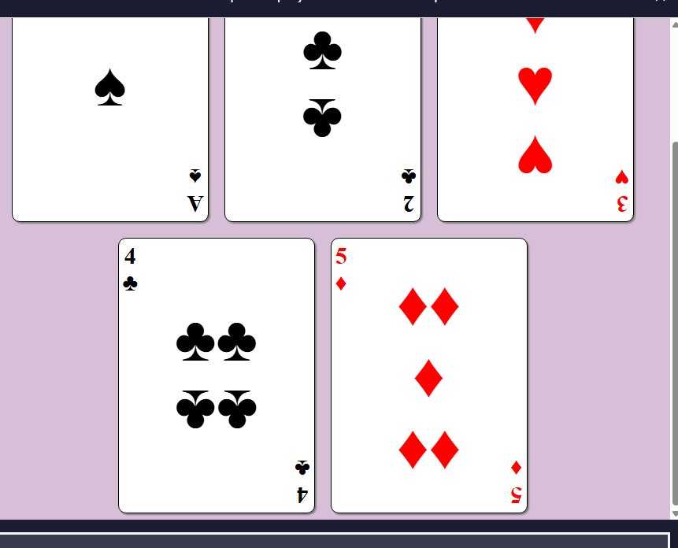
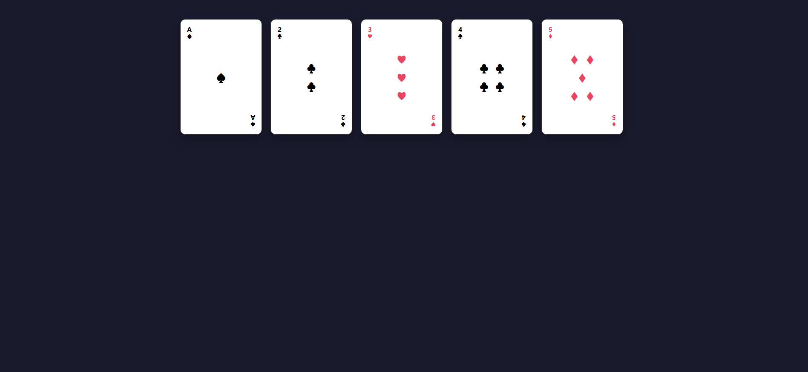
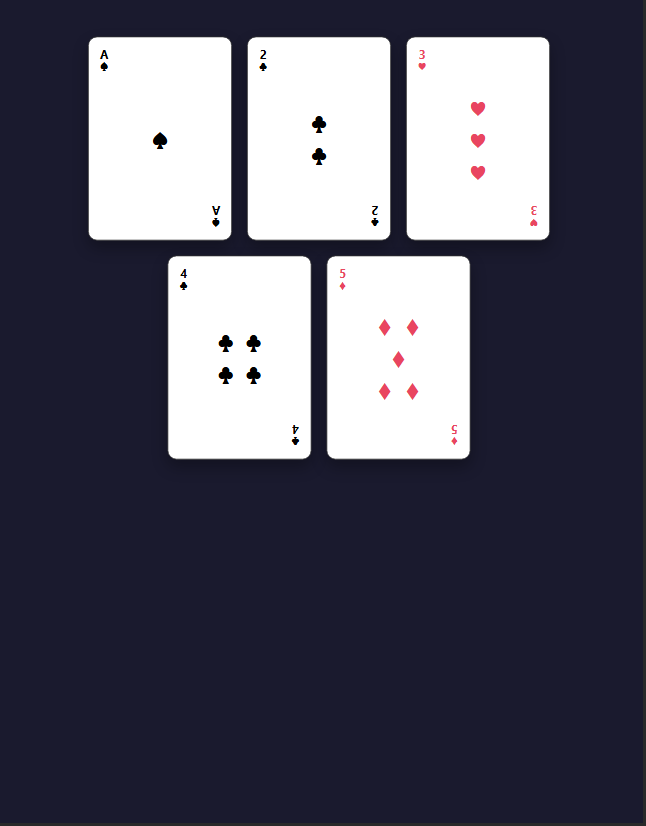

# 🃏 Set of Playing Cards - NovaDigit Studio

Ce projet fait partie de la certification "Responsive Web Design" de freeCodeCamp. L'objectif était de créer un set de cartes à jouer en utilisant exclusivement du HTML et du CSS (Flexbox et sélecteurs avancés).

## 🖼️ Comparaison et Rendu

| Modèle de base (FCC) | Version NovaDigit Studio (Desktop) |
| :---: | :---: |
|  |  |

### 📱 Vue Responsive (Mobile)

## 🚀 L'approche NovaDigit Studio (IA Assistée)
Le projet initial demandait une structure simple. J'ai choisi d'utiliser **Gemini** pour pousser le design bien au-delà des exigences :
- **Design Premium :** Ajout d'un mode sombre pour le fond et d'ombres portées (`box-shadow`) sur les cartes pour un effet de profondeur.
- **Interactivité :** Mise en place d'animations CSS (`hover` et `transform`) pour que les cartes se soulèvent au passage de la souris.
- **Réalisme :** Rotation à 180° des symboles inférieurs pour imiter de vraies cartes à jouer.

## 🛠️ Compétences validées
- **Flexbox :** Alignements complexes (`self-start`, `center`, `self-end`).
- **Pseudo-classes :** Utilisation de sélecteurs pour gérer les couleurs et les positions sans modifier l'HTML.
- **Responsive Design :** Utilisation de `flex-wrap` pour une adaptation parfaite sur mobile.
