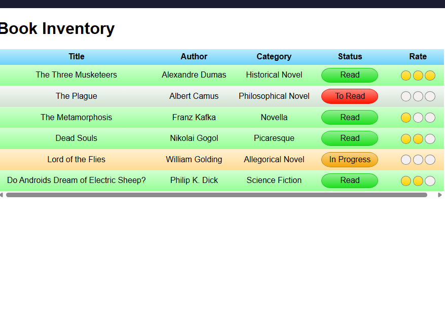

# 📚 Book Inventory App - NovaDigit Studio

Ce projet est une application de gestion d'inventaire de livres. Il démontre la maîtrise des structures de données tabulaires complexes et des sélecteurs d'attributs CSS avancés.

## 🖼️ Comparaison Visuelle

| Modèle imposé (FCC) | Version NovaDigit Studio (Coherence Edition) |
| :---: | :---: |
|  |  |

## 🚀 Design & Identité NovaDigit
Pour ce projet, j'ai appliqué la charte graphique de **NovaDigit Studio** afin d'assurer une cohérence visuelle avec les projets précédents :
- **Style Glassmorphism :** Le tableau utilise une transparence floutée (`backdrop-filter`) pour un rendu premium.
- **Néon Ratings :** Les indicateurs de notation ne sont plus de simples ronds, mais des éléments "lumineux" style LED.
- **Dark Mode Tech :** Utilisation du fond bleu nuit profond signature du studio pour une meilleure lisibilité.

## 🛠️ Techniques validées
- **HTML Sémantique :** Utilisation rigoureuse des balises `table`, `thead`, `tbody`, `tr`, `th` et `td`.
- **CSS Selectors :** Emploi de sélecteurs d'attributs (`[class~=""]`, `[class^=""]`) pour styliser dynamiquement les statuts.
- **Responsive Design :** Table parfaitement lisible et adaptée aux écrans larges.
