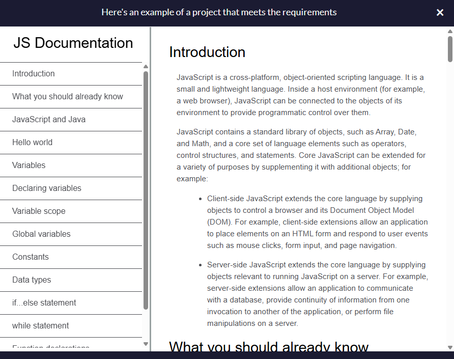
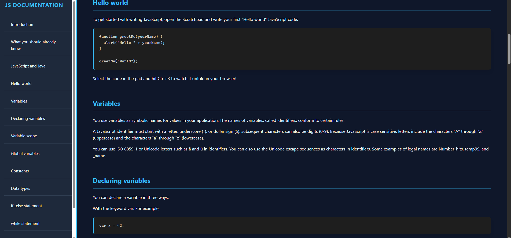
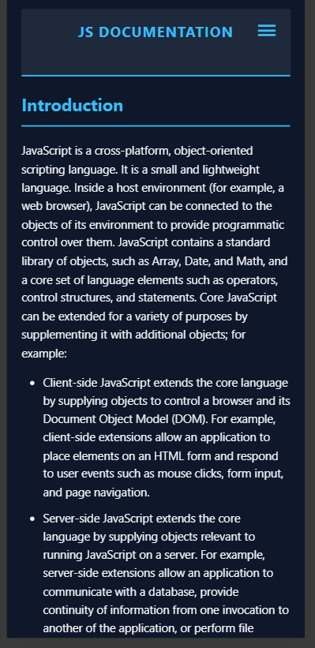

# 📘 Technical Documentation Page - NovaDigit Studio

Ce projet est une page de documentation technique complète pour JavaScript. Il démontre la maîtrise de la navigation interne, de la mise en page responsive complexe et du stylage de blocs de code.

## 🖼️ Comparaison Visuelle

| Modèle imposé (FCC) | Version NovaDigit Studio (Coherence Edition) |
| :---: | :---: |
|  |  |

### 📱 Focus Mobile & Dark Mode
Pour garantir une expérience optimale sur smartphone, le menu se replie intelligemment :

  

## 🚀 Design & Identité NovaDigit
Pour ce projet, j'ai appliqué la charte graphique de **NovaDigit Studio** afin d'assurer une cohérence visuelle avec les projets précédents :
- **Navigation Pro :** Une barre latérale fixe (desktop) qui devient un menu hamburger animé en pur CSS sur mobile.
- **Code IDE Style :** Les blocs de code utilisent le thème sombre signature du studio avec une bordure néon bleue pour un aspect "éditeur de code" professionnel.
- **Scroll Fluide :** Implémentation du scroll-behavior doux pour une navigation utilisateur premium entre les sections.

## 🛠️ Techniques validées
- **Architecture CSS :** Utilisation de `position: fixed` et `sticky` pour une navigation toujours accessible.
- **Zéro JS Mobile Menu :** Création d'un menu interactif performant utilisant uniquement des sélecteurs CSS (Checkbox hack).
- **Responsive Adaptatif :** Passage d'un layout colonne (mobile) à une structure à deux colonnes (desktop) via les Media Queries.
