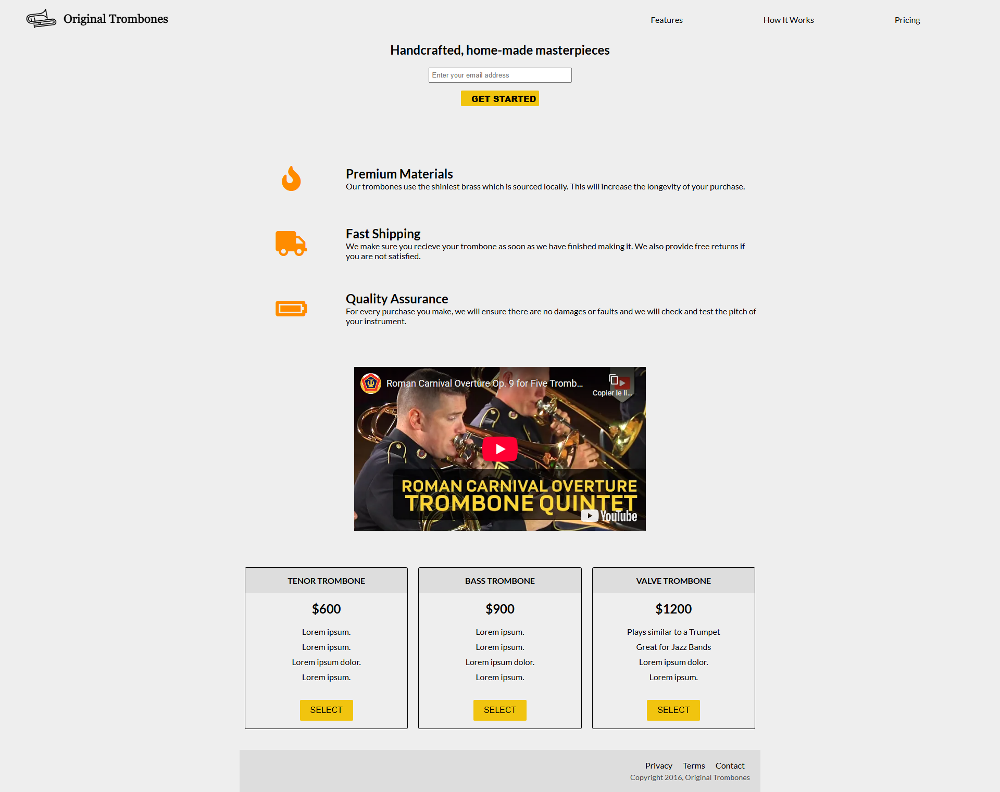
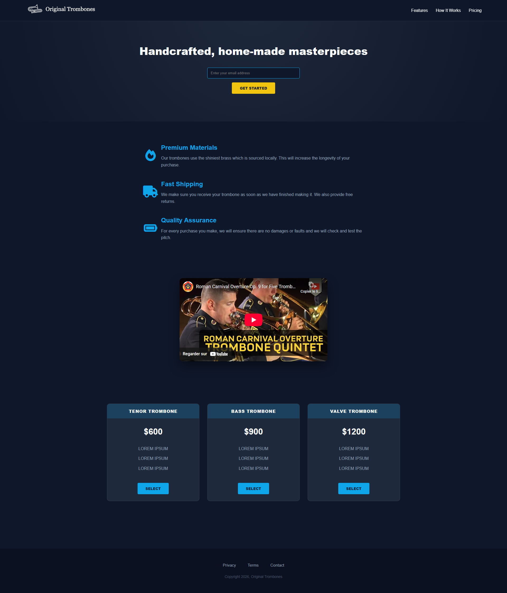

# 🎺 Product Landing Page - NovaDigit Studio

Ce projet fait partie de la certification "Responsive Web Design" de freeCodeCamp. L'objectif était de construire une page de vente moderne et fonctionnelle pour une marque de trombones premium.

## 🖼️ Comparaison et Rendu Visuel

| Modèle imposé (FCC) | Version NovaDigit Studio (Desktop) |
| :---: | :---: |
|  |  |

### 📱 Vue Responsive (Mobile)

## 🚀 L'approche NovaDigit Studio (IA Assistée)
Pour ce projet, j'ai utilisé **Gemini** et **Cursor** pour pousser l'intégration technique au niveau supérieur :
- **Modern Layout :** Passage d'une structure simple à un système **CSS Grid** robuste pour l'alignement des caractéristiques et des tarifs.
- **Dark Mode Correction :** Utilisation de filtres CSS (`brightness` et `invert`) pour rendre le logo original compatible avec le thème sombre de NovaDigit sans modifier l'image.
- **Glassmorphism :** Le header utilise un effet de flou (`backdrop-filter`) pour une navigation élégante et persistante.
- **UX Tech :** Intégration d'un mode "Glow" sur les boutons et les cartes au survol (hover) pour renforcer l'aspect premium.

## 🛠️ Spécifications techniques
- **CSS Grid & Flexbox :** Utilisation combinée pour une mise en page chirurgicale et responsive.
- **HTML5 Sémantique :** Respect strict des User Stories (Header, Nav-bar, Form, Iframe Vidéo).
- **Responsive Design :** Utilisation de Media Queries pour adapter les 3 colonnes de prix en une seule colonne sur mobile.

## 📁 Fichiers
- `index.html` : Structure sémantique complète.
- `styles.css` : Design personnalisé avec variables et grid system.
- `product-landing-page-model.png` : Capture du modèle fCC.
- `product-landing-page-desktop.png` : Capture finale version PC.
- `product-landing-page-mobile.png` : Capture finale version Mobile.
